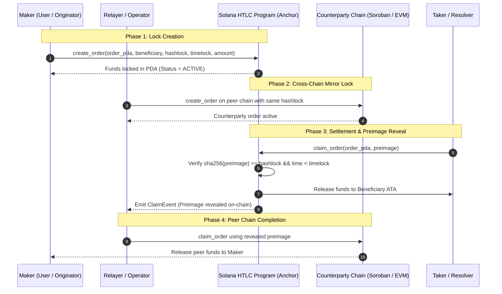

# Solana Operator Guide

**Audience**: Platform engineers, SREs, node operators, and relayer maintainers deploying and operating WaffleFinance on Solana.

---

## Table of Contents

1. [Trust Model & Architecture](#trust-model--architecture)
2. [Contract Lifecycle & Anchor Deployment](#contract-lifecycle--anchor-deployment)
3. [Devnet Assumptions vs Production Readiness Gap Audit](#devnet-assumptions-vs-production-readiness-gap-audit)
4. [Settlement Flow & Transaction Lifecycle](#settlement-flow--transaction-lifecycle)
5. [Startup Validation and Production Gating](#startup-validation-and-production-gating)
6. [RPC Degradation & Multi-Endpoint Failover](#rpc-degradation--multi-endpoint-failover)
7. [Operations Checklist for Solana Settlement](#operations-checklist-for-solana-settlement)
8. [Incident Response & Recovery Procedures](#incident-response--recovery-procedures)

---

## Trust Model & Architecture

The WaffleFinance Solana HTLC program enforces the same mathematical atomicity guarantees as our Soroban and EVM smart contracts: locked assets can **only** move when a cryptographic condition is satisfied on-chain. Neither the coordinator, relayer, program deployer, nor any resolver has custodial control or unilateral power to move locked assets.

| Actor | Permitted Actions | Prohibited / Impossible Actions |
|---|---|---|
| **User (Maker / Locker)** | Create HTLC orders (`create_order`), claim with preimage, reclaim funds via `refund_order` strictly after timelock expiry | Claim without valid 32-byte preimage; refund before timelock expiry; drain other orders |
| **Beneficiary (Taker / Resolver)** | Claim locked assets (`claim_order`) by providing the valid SHA256 preimage before timelock expiry | Claim after timelock expiry; alter recipient address; withdraw unassociated funds |
| **Relayer / Submitter** | Submit signed transactions on behalf of users or automated solvers, batch priority fee compute instructions | Alter order parameters; sign unauthorized transactions; divert claimed tokens |
| **Coordinator** | Index on-chain state, relay secret preimages, match cross-chain swap legs | Sign on behalf of users; seize or hold escrowed assets |
| **Program Upgrade Authority** | Upgrade program bytecode (when authority is active) | Access or drain funds locked inside active Order PDAs |

### Key Architectural Invariants

1. **PDA-Based Escrow Isolation**: Each HTLC order is stored in its own Program-Derived Address (PDA) derived canonically via seeds `[b"order", hashlock_32_bytes]`. Each order is completely isolated with its own rent-exempt balance and independent token vault.
2. **Non-Custodial Atomicity**: The Solana HTLC program holds tokens directly in the Order PDA token account (or lamports directly in the Order PDA for native SOL). Funds can transition to exactly two terminal states:
   - `CLAIMED`: Beneficiary receives tokens/SOL upon presenting the exact SHA256 preimage (`sha256(preimage) == hashlock`) before `Clock::get()?.unix_timestamp >= timelock`.
   - `REFUNDED`: Original payer/creator receives tokens/SOL back after `Clock::get()?.unix_timestamp >= timelock`.
3. **Rent Reclamation**: When an order account is closed upon successful `claim_order` or `refund_order`, the lamports allocated for account rent exemption (~0.0025 SOL) are automatically returned to the designated payer account.

---

## Contract Lifecycle & Anchor Deployment

### Phase 1: Verifiable Build

All Solana HTLC program artifacts deployed to testnet or mainnet must be built verifiably to allow open-source bytecode verification against GitHub commit SHAs.

```bash
cd solana
anchor build --verifiable
```

Run the automated Solana Anchor test suite:

```bash
anchor test
```

### Phase 2: Cluster Deployment

Deploy the compiled ELF binary (`wafflefinance_htlc.so`) using the Solana CLI:

```bash
# Testnet / Devnet deployment
solana program deploy \
  --url https://api.devnet.solana.com \
  --program-id target/deploy/wafflefinance_htlc-keypair.json \
  target/deploy/wafflefinance_htlc.so

# Mainnet-Beta deployment
solana program deploy \
  --url https://solana-mainnet.g.alchemy.com/v2/YOUR_API_KEY \
  --program-id target/deploy/wafflefinance_htlc-keypair.json \
  target/deploy/wafflefinance_htlc.so
```

Record the deployed Program Public Key.
- For devnet/testnet: Set `SOLANA_HTLC_PROGRAM_TESTNET` in your environment.
- For mainnet: Set `SOLANA_HTLC_PROGRAM_MAINNET` in your environment.

### Phase 3: Bytecode Verification

Verify the on-chain deployed bytecode against the source repository using `solana-verify`:

```bash
solana-verify verify-from-repo \
  --program-id <PROGRAM_ID> \
  https://github.com/Waffle-finance/waffle-finance-core \
  --mount-path solana
```

### Phase 4: Upgrade Authority Handover

For production deployments, the program upgrade authority must never remain on an engineer's single hot wallet. Transfer authority to a multi-signature safe (such as Squads Protocol) or revoke authority for an immutable deployment:

```bash
# Transfer upgrade authority to Squads multisig vault
solana program set-upgrade-authority <PROGRAM_ID> \
  --new-upgrade-authority <SQUADS_VAULT_ADDRESS>
```

---

## Devnet Assumptions vs Production Readiness Gap Audit

Operating on Solana Devnet relies on multiple simplified assumptions that are invalid or dangerous in a production Mainnet environment. The following audit details the gaps and required mitigations.

| Operational Domain | Devnet Assumption | Mainnet-Beta Production Requirement | Gap & Risk Severity | Production Mitigation |
|---|---|---|---|---|
| **1. RPC Node Topology** | Single public RPC (`api.devnet.solana.com`). | Multi-endpoint private RPC pool (e.g. Helius, Triton, QuickNode, Alchemy) with automated health check failover. | **CRITICAL**: Public RPC is aggressively rate-limited (403/429) and subject to unannounced cluster resets. | Use `SolanaRpcProvider` with at least 2 independent paid RPC endpoints and active circuit breakers. |
| **2. Finality & Commitment** | `confirmed` commitment (~400-800ms) with near-zero reorg probability under devnet test loads. | `finalized` commitment (32+ slots, ~13s) for irreversible financial settlement, or confirmation depth tracking. | **CRITICAL**: Cross-chain swaps releasing funds on counterparty chains based on shallow `confirmed` slots risk double-spend via micro-forks. | Enforce `finalized` commitment before triggering counterparty chain unlocks, or require at least 32 confirmation slots. |
| **3. Priority Fees & Compute Budget** | Transactions with default 0 priority fee land consistently without latency. | Dynamic `ComputeBudgetProgram.setComputeUnitPrice` (micro-lamports per CU) sized to current network congestion. | **CRITICAL**: During high mainnet congestion, 0-priority-fee transactions are dropped, causing claim timeouts and financial loss. | Integrate dynamic priority fee estimation (`getPriorityFeeEstimate`) with upper fee caps per transaction. |
| **4. Token Mints & Decimals** | Devnet mock USDC mint (`4zMMC9srt5Ri5X14GAgXhaHii3GnPAEERYPJgZJDncDU`) with unverified decimals. | Official Circle USDC (`EPjFWdd5AufqSSqeM2qN1xzybapC8G4wEGGkZwyTDt1v`) with strict 6-decimal verification, or Wrapped SOL (`So11111111111111111111111111111111111111112`). | **CRITICAL**: Locking mock devnet tokens in a mainnet swap causes total loss of funds. | Use SDK `MAINNET_TOKEN_MINTS` validation and `assessSolanaProductionReadiness()`. |
| **5. Associated Token Accounts (ATA)** | Recipient ATAs are assumed to be pre-created by developer scripts. | Beneficiary ATA may not exist on-chain; claims must handle ATA creation idempotently. | **HIGH**: Claims fail if beneficiary has never held the target token, bricking settlement until ATA is funded. | Include `createAssociatedTokenAccountIdempotent` instruction prior to claim instruction in the atomic transaction bundle. |
| **6. Rent Exemption & SOL Reserves** | Devnet faucet air-drops unlimited free SOL for account creation. | Operator and vault hot wallets require genuine SOL reserves for Order PDAs (~0.0025 SOL) and ATAs (~0.00204 SOL). | **HIGH**: Relayers run out of gas/rent, preventing new lock creation or automated claim submission. | Configure automated hot wallet balance monitoring and alerts when operator balance drops below 0.5 SOL. |
| **7. Wallet Cluster Safety** | Developer manually switches network in Phantom / Backpack / Solflare. | Client dApp checks connected wallet cluster / genesis hash to prevent cross-network submission. | **MEDIUM**: User on Devnet wallet sending funds to Mainnet program or vice versa fails or locks funds erroneously. | Enforce genesis hash matching (`5eykt4UsFv8P8NJdTREpY1vzqKqZKvdpKuc147dw2N9d` for mainnet-beta). |

---

## Settlement Flow & Transaction Lifecycle

The Solana cross-chain settlement flow proceeds through three deterministic phases:



### Safety Timelock Calibration

To guarantee atomic settlement across chains with differing block times:
- **Solana Leg Timelock**: Set to $T_{counterparty} + \Delta_{buffer}$.
- **Minimum Buffer ($\Delta_{buffer}$)**: At least **15 minutes** (900 seconds) to account for Solana congestion spikes or counterparty chain finality delays.

---

## Startup Validation and Production Gating

The SDK provides programmatic readiness checks and gating functions to ensure applications and relayers fail fast if configured with unsafe devnet assumptions in a production environment.

### Programmatic Readiness Assessment

```typescript
import {
  assessSolanaProductionReadiness,
  assertSolanaProductionReady,
  SolanaProductionGatingError,
} from "@wafflefinance/sdk/solana";

const report = assessSolanaProductionReadiness({
  environment: "mainnet-beta",
  programId: process.env.SOLANA_HTLC_PROGRAM,
  rpcEndpoints: [
    "https://solana-mainnet.g.alchemy.com/v2/YOUR_KEY",
    "https://mainnet.helius-rpc.com/?api-key=YOUR_KEY",
  ],
  commitment: "finalized",
  hasPriorityFeeStrategy: true,
  tokenMints: ["EPjFWdd5AufqSSqeM2qN1xzybapC8G4wEGGkZwyTDt1v"], // Official Mainnet USDC
  strictProductionMode: true,
});

if (!report.isProductionReady) {
  console.error("Solana production readiness gating failed:", report.blockers);
  process.exit(1);
}
```

### Strict Gating Assertion

Call `assertSolanaProductionReady(options)` during relayer or coordinator service startup. If any blocking assumption is violated, it throws a structured `SolanaProductionGatingError` with all failed audit items.

### Pre-Submission Account Metadata Validation

To eliminate RPC simulation runtime errors, enable `validateBeforeSubmit` in `SolanaHTLCClient`:

```typescript
import { SolanaHTLCClient } from "@wafflefinance/sdk/solana";

const client = new SolanaHTLCClient({
  rpcUrl: "https://solana-mainnet.g.alchemy.com/v2/YOUR_KEY",
  programId: process.env.SOLANA_HTLC_PROGRAM!,
  commitment: "finalized",
  validateBeforeSubmit: true, // Enables pre-submission account & rent checks
});
```

---

## RPC Degradation & Multi-Endpoint Failover

Production deployments must never rely on a single Solana RPC endpoint. The `@wafflefinance/sdk` includes `SolanaRpcProvider` which manages a resilient multi-endpoint pool with automatic circuit breakers.

### Configuring Multi-Endpoint Failover

```typescript
import { createSolanaRpcProvider } from "@wafflefinance/sdk/solana";

const rpcProvider = createSolanaRpcProvider(
  [
    "https://solana-mainnet.g.alchemy.com/v2/YOUR_KEY",
    "https://mainnet.helius-rpc.com/?api-key=YOUR_KEY",
    "https://solana-rpc.quicknode.pro/YOUR_KEY",
  ],
  "finalized",
  {
    maxFailuresBeforeCooldown: 3,
    cooldownPeriodMs: 30_000,
    requestTimeoutMs: 10_000,
    retryAttemptsPerEndpoint: 2,
  }
);

// Resilient execution across failover pool
const slot = await rpcProvider.withFallback(
  (connection) => connection.getSlot("finalized"),
  "getSlot"
);
```

### RPC Health Metrics to Monitor

1. **Endpoint Consecutive Failures**: Alert when any endpoint exceeds 2 consecutive RPC timeouts.
2. **Fallback Activations**: Track count of failover events across secondary/tertiary providers.
3. **Slot Lag**: Alert if any RPC provider lags >20 slots behind network tip.

---

## Operations Checklist for Solana Settlement

All node operators and platform engineers must execute this checklist before enabling live production cross-chain volume on Solana.

### Phase 1: Pre-Deployment & Key Management
- [ ] **OP-SOL-01 (CRITICAL)**: Solana HTLC Anchor program compiled with `anchor build --verifiable` and verified on-chain via `solana-verify`.
- [ ] **OP-SOL-02 (CRITICAL)**: Program upgrade authority transferred to a multi-signature safe (e.g. Squads Protocol) or finalized.
- [ ] **OP-SOL-03 (CRITICAL)**: Relayer hot wallet private keys stored in AWS Secrets Manager or HashiCorp Vault; never in environment files or code.

### Phase 2: RPC Infrastructure & Failover
- [ ] **OP-SOL-04 (HIGH)**: Primary, secondary, and tertiary private RPC endpoints configured in `SolanaRpcProvider`.
- [ ] **OP-SOL-05 (HIGH)**: Websocket subscriptions (`wss://`) verified for real-time account change indexing.
- [ ] **OP-SOL-06 (MEDIUM)**: RPC latency, rate-limiting (429), and error rate alerting thresholds configured in Prometheus/Datadog.

### Phase 3: Token Mint & ATA Lifecycle
- [ ] **OP-SOL-07 (CRITICAL)**: Official SPL Token mint addresses validated against Mainnet token lists (e.g. Circle USDC `EPjFWdd5AufqSSqeM2qN1xzybapC8G4wEGGkZwyTDt1v`).
- [ ] **OP-SOL-08 (HIGH)**: Idempotent ATA creation (`createAssociatedTokenAccountIdempotent`) included in claim transaction pipelines.
- [ ] **OP-SOL-09 (HIGH)**: Relayer hot wallet SOL balance monitored with automated low-balance alerts (`balance < 0.5 SOL`).

### Phase 4: Settlement Execution & Confirmation
- [ ] **OP-SOL-10 (CRITICAL)**: Dynamic priority fee pricing strategy (`ComputeBudgetProgram.setComputeUnitPrice`) enabled to prevent dropped transactions during congestion.
- [ ] **OP-SOL-11 (CRITICAL)**: Cross-chain counterparty release strictly requires `finalized` commitment (or 32+ confirmed slots).
- [ ] **OP-SOL-12 (HIGH)**: Order timelock durations include at least 15 minutes of safety buffer relative to counterparty chain timelocks.

### Phase 5: Incident Response & Recovery
- [ ] **OP-SOL-13 (HIGH)**: Automated refund monitoring worker active to reclaim expired HTLCs after timelock expiry.
- [ ] **OP-SOL-14 (MEDIUM)**: Runbooks established and drilled for Solana cluster halts or network degradation.

---

## Incident Response & Recovery Procedures

### 1. Reclaiming an Expired HTLC Order (Refund Flow)

If a counterparty fails to fulfill the cross-chain swap before timelock expiry, the locked funds can be refunded back to the originator:

```bash
# Verify order on-chain state and timelock
npx @wafflefinance/cli solana order-status --order-pda <ORDER_PDA>

# Submit refund transaction after timelock has elapsed
npx @wafflefinance/cli solana refund --order-pda <ORDER_PDA> --keypair <OPERATOR_KEYPAIR>
```

### 2. Handling Mainnet Network Congestion / Dropped Transactions

During periods of severe Solana network load, transactions with insufficient priority fees may expire in the validator pending pool without inclusion.

**Procedure**:
1. Check transaction status via `Connection.getSignatureStatus(sig)`.
2. If unconfirmed after 60 seconds (or blockhash expired):
   - Fetch fresh recent blockhash via `getLatestBlockhash("confirmed")`.
   - Re-estimate dynamic priority fee using 75th percentile micro-lamports per CU.
   - Re-sign and broadcast transaction with updated `ComputeBudgetProgram.setComputeUnitPrice`.

### 3. Missing Associated Token Account on Claim

If a claim transaction fails with `AccountNotInitialized` on the token recipient:
1. Prepend `createAssociatedTokenAccountIdempotent` instruction to the claim transaction.
2. Ensure fee payer has sufficient SOL to cover the ~0.00204 SOL ATA rent exemption.
3. Re-submit atomic transaction containing both ATA creation and HTLC claim instructions.

---

## Summary & References

- **Soroban Operator Guide**: [SOROBAN_OPERATOR_GUIDE.md](file:///c:/Users/DELL/Documents/GitHub/waffle-finance-coreAnorak/docs/SOROBAN_OPERATOR_GUIDE.md)
- **Architecture Overview**: [ARCHITECTURE.md](file:///c:/Users/DELL/Documents/GitHub/waffle-finance-coreAnorak/docs/ARCHITECTURE.md)
- **Release Contract**: [RELEASE_CONTRACT.md](file:///c:/Users/DELL/Documents/GitHub/waffle-finance-coreAnorak/docs/RELEASE_CONTRACT.md)
- **Operations Runbook**: [OPERATIONS.md](file:///c:/Users/DELL/Documents/GitHub/waffle-finance-coreAnorak/docs/OPERATIONS.md)
